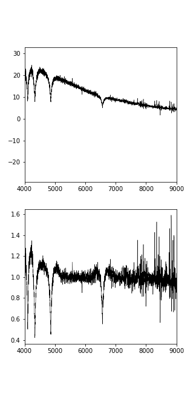

## StarSpectraClassifier
This script is used to classify star flux spectra by convolutional neural networks. The data used here are six types of spectra 
named wdsb2, wd, yso, hotstars, fgkm and cv, respectively.

### Installation
This code is based on python2.7 and some packages such as tensorflow and astropy. Before you use it, you should first install corresponding environment.

- Download</br>
You should clone this repository first by 
```
git clone git@github.com:POFK/starspectraclassifier.git --recursive
```

- Miniconda </br>
I recommend conda or miniconda as the environment manager and you can download it [here](https://conda.io/miniconda.html).

- Dependences </br>
If you have installed conda environment, you can create the environment as follows.

```
conda config --add channels conda-forge
conda create -n SSC python=2.7
source activate SSC
conda install --file requirements.txt
```

### Usage
#### Preprocessing
Before classify the star spectra, some data clean and preprocessing should be performed on the original spectra. The model only use flux and wavelength information, do not take into account any other information, such as mask, error and SNR. </br>
The preprocessing is as follows: </br>
- For each spectrum, we interpolate the flux to new wavelength data points from 3900<span>&#8491;</span> 
to 9000<span>&#8491;</span>. Through this interpolation, we resample the flux spectra to same wavelength data points and obtain new flux spectra $F_{i}$. All spectra that do not have enough wavelength range are removed in this step.
- Then, we perform a Gaussian smoothing with $\sigma=20$nm and obtain smoothed spectra $F_{s}$
- We use $F_i/F_s$ to generate the training set.

The upper and lower panels below give examples of the spectrum without and with preprocessing. </br>
 </br>
More details about preprocessing can be found in [this file](./clean.py). If you only hope to use the network model, I provide an example to generate the dataset that can be used by the model directly in [this file](./exam_preprocessing.ipynb).

#### training set
[This file](./exam_eval.ipynb) gives an example about how to use the network model.
